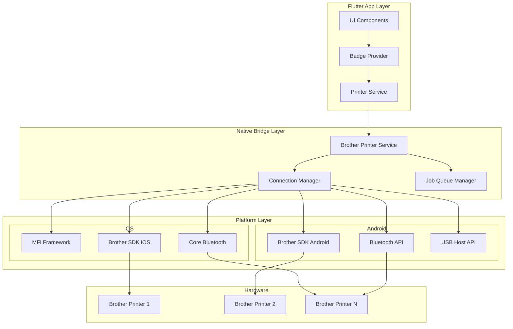
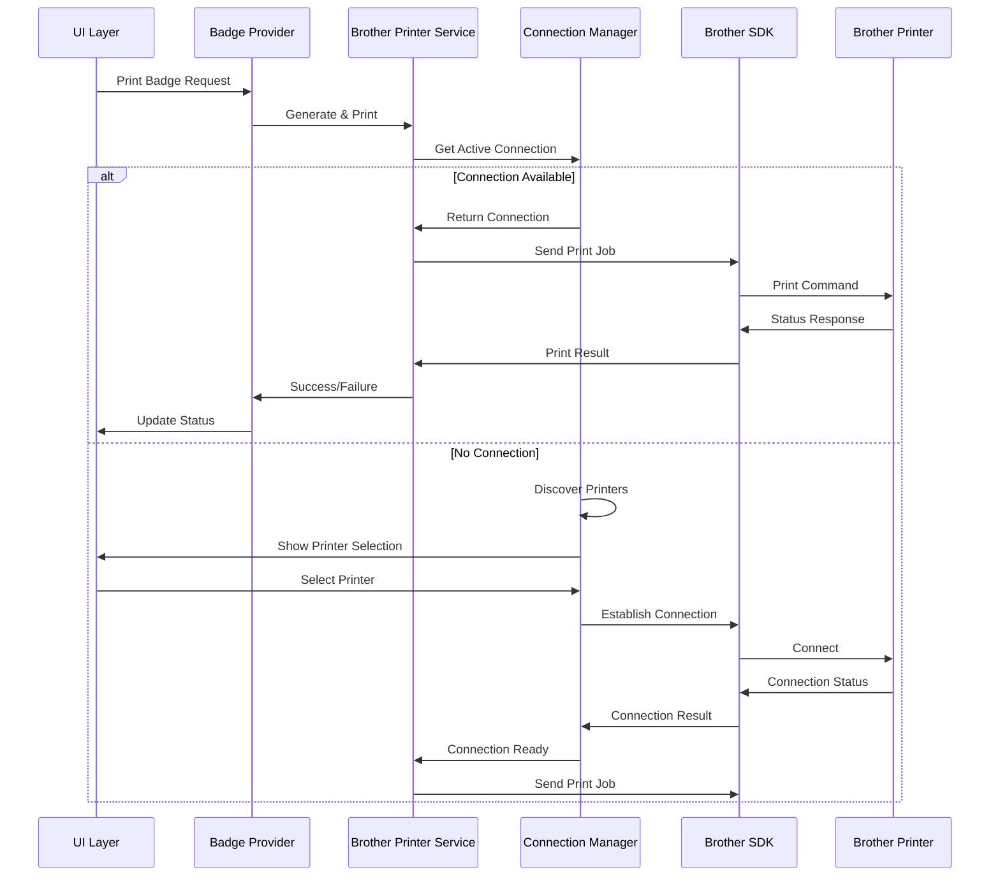

# Design Document

## Overview

This design document outlines the implementation of native Brother label printer integration for the event check-in mobile app. The solution will provide direct printing capabilities without dialogs, support for MFi compliance on iOS, Bluetooth connectivity for both platforms, and optimized performance for high-volume event scenarios.

The design builds upon the existing Flutter app architecture while introducing new native components and services to handle Brother printer communication, connection management, and print job processing.

## Architecture

### High-Level Architecture



### Component Interaction Flow



## Components and Interfaces

### 1. Brother Printer Service (Native)

**Purpose**: Core service for Brother printer communication and print job management.

**Key Responsibilities**:
- Initialize Brother SDK
- Manage printer connections
- Process print jobs
- Handle error recovery
- Optimize print data

**Interface**:
```dart
abstract class BrotherPrinterService {
  Future<void> initialize();
  Future<List<BrotherPrinter>> discoverPrinters();
  Future<bool> connectToPrinter(String printerId);
  Future<PrintResult> printBadge(BadgeData badgeData);
  Future<PrintResult> printMultipleBadges(List<BadgeData> badges);
  Stream<PrinterStatus> get statusStream;
  Future<void> disconnect();
}
```

### 2. Connection Manager

**Purpose**: Manages printer connections across different connection types (Bluetooth, WiFi, USB).

**Key Responsibilities**:
- Handle MFi authentication on iOS
- Manage Bluetooth pairing and reconnection
- Monitor connection health
- Implement connection pooling
- Handle connection timeouts

**Interface**:
```dart
abstract class ConnectionManager {
  Future<void> initializeConnections();
  Future<List<PrinterConnection>> scanForPrinters();
  Future<PrinterConnection> establishConnection(PrinterInfo printer);
  Future<bool> testConnection(String connectionId);
  Stream<ConnectionEvent> get connectionEvents;
  Future<void> closeConnection(String connectionId);
}
```

### 3. Print Job Queue Manager

**Purpose**: Manages print job queuing, batching, and retry logic.

**Key Responsibilities**:
- Queue print jobs for processing
- Implement retry logic for failed jobs
- Batch multiple jobs for efficiency
- Provide job status updates
- Handle background processing

**Interface**:
```dart
abstract class JobQueueManager {
  Future<String> queuePrintJob(PrintJob job);
  Future<void> processPendingJobs();
  Future<JobStatus> getJobStatus(String jobId);
  Stream<QueueEvent> get queueEvents;
  Future<void> retryFailedJob(String jobId);
  Future<void> cancelJob(String jobId);
}
```

### 4. Badge Optimization Engine

**Purpose**: Optimizes badge content for Brother printer capabilities and label formats.

**Key Responsibilities**:
- Convert PDF to Brother-compatible formats
- Optimize image resolution and compression
- Handle label size detection and adjustment
- Implement dithering for monochrome printers
- Cache optimized badge data

**Interface**:
```dart
abstract class BadgeOptimizationEngine {
  Future<OptimizedBadge> optimizeBadge(BadgeTemplate template, Attendee attendee);
  Future<List<OptimizedBadge>> optimizeMultipleBadges(List<BadgeData> badges);
  Future<LabelFormat> detectLabelFormat(String printerId);
  Future<PrinterCapabilities> getPrinterCapabilities(String printerId);
}
```

### 5. Platform-Specific Implementations

#### iOS Implementation
- **MFi Integration**: Use External Accessory framework for MFi-certified printers
- **Core Bluetooth**: Handle Bluetooth Low Energy connections
- **Brother SDK iOS**: Native Brother printer communication
- **Simulator Support**: Conditional compilation to exclude Brother SDK in simulator builds

#### Android Implementation
- **Bluetooth Classic/LE**: Use Android Bluetooth APIs
- **USB Host**: Support USB-connected printers
- **Brother SDK Android**: Native Brother printer communication

#### Simulator Build Strategy

For iOS simulator compatibility, the implementation will use conditional compilation to exclude Brother SDK dependencies:

**Native iOS Implementation:**
```swift
#if targetEnvironment(simulator)
// Mock implementations for simulator
class MockBrotherPrinterService: BrotherPrinterServiceProtocol {
    func discoverPrinters() -> [BrotherPrinter] {
        return [BrotherPrinter.mockPrinter()]
    }
    
    func printBadge(_ data: BadgeData) -> PrintResult {
        return PrintResult.simulatorSuccess()
    }
}
#else
// Real Brother SDK implementation for physical devices
class BrotherPrinterService: BrotherPrinterServiceProtocol {
    // Full Brother SDK integration
}
#endif
```

**Flutter Integration:**
```dart
class BrotherPrinterService {
  static bool get isSimulator => Platform.isIOS && 
      (Platform.environment['SIMULATOR_DEVICE_NAME'] != null);
  
  Future<PrintResult> printBadge(BadgeData data) async {
    if (isSimulator) {
      return PrintResult.simulatorMode();
    }
    return await _nativePrint(data);
  }
}
```

**Build Configuration:**
- Use Xcode build settings to conditionally link Brother SDK frameworks
- Exclude Brother SDK from simulator builds in podspec configurations
- Provide mock implementations that return appropriate simulator responses

## Data Models

### Printer Models

```dart
class BrotherPrinter {
  final String id;
  final String name;
  final String model;
  final PrinterConnectionType connectionType;
  final PrinterCapabilities capabilities;
  final bool isMfiCertified;
  final String? bluetoothAddress;
  final String? ipAddress;
  final PrinterStatus status;
}

class PrinterCapabilities {
  final List<LabelSize> supportedLabelSizes;
  final int maxResolutionDpi;
  final bool supportsColor;
  final bool supportsCutting;
  final int maxPrintWidth;
  final List<String> supportedFormats;
}

class LabelSize {
  final String id;
  final String name;
  final double widthMm;
  final double heightMm;
  final bool isRoll;
}
```

### Print Job Models

```dart
class PrintJob {
  final String id;
  final String printerId;
  final BadgeData badgeData;
  final PrintSettings settings;
  final DateTime createdAt;
  final JobPriority priority;
  final int retryCount;
}

class PrintResult {
  final bool success;
  final String? errorMessage;
  final String? errorCode;
  final Duration printTime;
  final int labelCount;
}

class PrintSettings {
  final LabelSize labelSize;
  final int copies;
  final bool autoCut;
  final PrintQuality quality;
  final bool mirror;
}
```

### Connection Models

```dart
class PrinterConnection {
  final String id;
  final String printerId;
  final PrinterConnectionType type;
  final ConnectionStatus status;
  final DateTime lastActivity;
  final Map<String, dynamic> connectionData;
}

enum PrinterConnectionType {
  bluetooth,
  bluetoothLE,
  wifi,
  usb,
  mfi
}

enum ConnectionStatus {
  disconnected,
  connecting,
  connected,
  error,
  authenticating
}
```

## Error Handling

### Error Categories

1. **Connection Errors**
   - Bluetooth pairing failures
   - Network connectivity issues
   - MFi authentication failures
   - USB connection problems

2. **Print Errors**
   - Out of labels
   - Printer jam
   - Low battery
   - Unsupported label size

3. **Data Errors**
   - Invalid badge template
   - Image conversion failures
   - Corrupted print data

### Error Recovery Strategies

```dart
class ErrorRecoveryManager {
  Future<RecoveryAction> determineRecoveryAction(PrintError error) {
    switch (error.type) {
      case ErrorType.connectionLost:
        return RecoveryAction.reconnect;
      case ErrorType.outOfLabels:
        return RecoveryAction.pauseAndNotify;
      case ErrorType.printerJam:
        return RecoveryAction.pauseAndNotify;
      case ErrorType.lowBattery:
        return RecoveryAction.queueForLater;
      default:
        return RecoveryAction.retry;
    }
  }
}
```

## Testing Strategy

### Unit Testing
- Test individual service components
- Mock Brother SDK interactions
- Validate data model serialization
- Test error handling logic

### Integration Testing
- Test printer discovery and connection
- Validate print job processing
- Test connection recovery scenarios
- Verify MFi authentication flow

### Device Testing
- Test on various Brother printer models
- Validate Bluetooth connectivity
- Test USB and WiFi connections
- Performance testing with high-volume printing

### Platform Testing
- iOS MFi compliance testing
- Android Bluetooth permission handling
- Cross-platform feature parity
- Battery usage optimization

## Performance Optimizations

### Connection Management
- **Connection Pooling**: Maintain persistent connections to frequently used printers
- **Background Scanning**: Continuously scan for available printers in background
- **Connection Caching**: Cache connection parameters for faster reconnection

### Print Job Processing
- **Batch Processing**: Group multiple print jobs for efficient processing
- **Data Compression**: Compress print data to reduce transmission time
- **Parallel Processing**: Process multiple jobs simultaneously when possible

### Memory Management
- **Image Caching**: Cache optimized badge images to avoid reprocessing
- **Memory Pooling**: Reuse memory buffers for print data
- **Garbage Collection**: Proactive cleanup of temporary resources

### Battery Optimization
- **Adaptive Scanning**: Reduce scan frequency when no printers are needed
- **Connection Timeout**: Automatically close idle connections
- **Background Processing**: Minimize CPU usage during background operations

## Security Considerations

### Data Protection
- Encrypt sensitive attendee data in print jobs
- Secure storage of printer connection credentials
- Implement data retention policies for print logs

### Network Security
- Validate printer certificates for WiFi connections
- Implement secure pairing for Bluetooth connections
- Use encrypted communication channels where possible

### Access Control
- Implement printer access permissions
- Log all print activities for audit trails
- Restrict printer configuration changes

## Deployment Strategy

### Phased Rollout
1. **Phase 1**: Core Brother printer integration with basic printing
2. **Phase 2**: Advanced features (MFi, Bluetooth LE, job queuing)
3. **Phase 3**: Performance optimizations and analytics
4. **Phase 4**: Additional printer model support

### Configuration Management
- Remote configuration updates for printer settings
- Feature flags for gradual feature rollout
- A/B testing for performance optimizations

### Monitoring and Analytics
- Print success/failure rates
- Connection reliability metrics
- Performance benchmarks
- User experience analytics